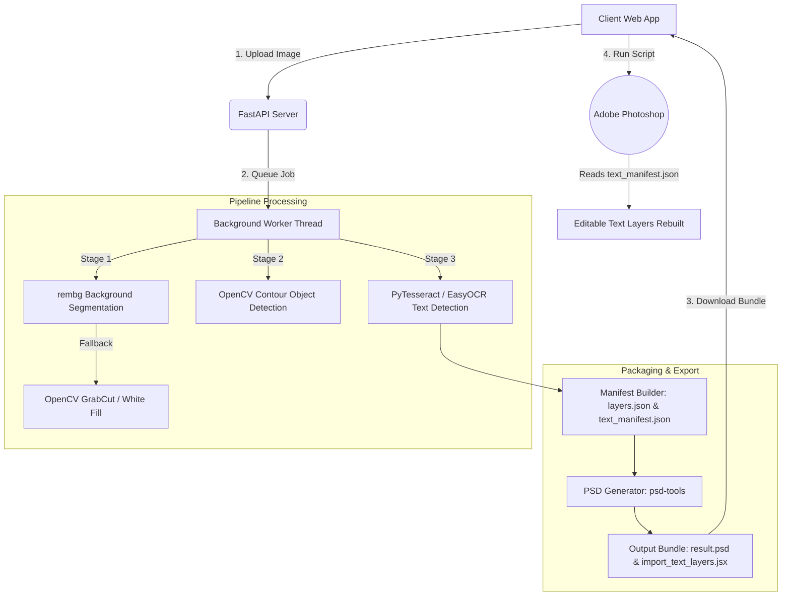

# 📖 How Stratum Was Built: A Step-by-Step Engineering Walkthrough

This document outlines the step-by-step development process, architecture design, and technical decisions made while building **Stratum**, an open-source AI-powered image decomposition framework. Stratum decomposes flat images (PNG, JPEG, WEBP) into layered Photoshop files (PSDs) with editable text layers.

---

## 🏗️ Architectural Blueprint

Before coding, we designed a decoupled architecture featuring a **React client** and a **FastAPI backend server**. The backend orchestrates a multi-stage background pipeline that uses deep learning and computer vision to extract background, objects, and text.

---

## 🛠️ Step-by-Step Implementation

### Step 1: Project Initialization & Root Scaffolding
We initialized the repository with a strict separation of concerns:
- `image-to-psd-backend/`: The Python FastAPI application handling heavy computation.
- `frontend/`: The React web client built with Vite and Tailwind/Vanilla CSS.
- `docs/`: API references, specifications, user guides, and visuals.

A system-level `.gitignore` was configured to ignore Python virtual environments (`.venv`), Node modules (`node_modules`), build output bundles (`dist`), and generated jobs (`outputs/`).

---

### Step 2: Developing Core Computer Vision Services (Backend)
The heart of Stratum lies in its modular processing services under [image-to-psd-backend/services/](file:///x:/projects/stratum/stratum/image-to-psd-backend/services/):

1. **Background Segmentation (`segmentor.py`)**:
   - Uses `rembg` (powered by the **U-2-Net** neural network model) to segment foreground graphics.
   - **Resilience Strategy**: If the `rembg` session fails or ONNX Runtime is missing, it falls back to **OpenCV GrabCut** contour segmentation. If GrabCut fails, it performs a solid white background fill.
2. **Object Detection (`object_detector.py`)**:
   - Extracts the alpha channel of the segmented foreground image.
   - Runs OpenCV thresholding (`threshold`) and contour detection (`findContours`) to locate separate graphic elements.
   - Filters out small noise using `MIN_OBJECT_AREA = 1000` pixels and crops each object into its own alpha-mapped PNG layer.
3. **Text OCR Extraction (`ocr_service.py`)**:
   - Uses PyTesseract (LSTM engine) to detect, crop, and run character recognition.
   - **Resilience Strategy**: Falls back to **EasyOCR** (PyTorch, ResNet, BiLSTM architecture) if Tesseract is not installed on the system PATH.
   - Text bounding boxes are grouped, saved as individual PNG crop layers, and cached.

---

### Step 3: API Framework & Background Threading
We built the API layer in [image-to-psd-backend/routes/api.py](file:///x:/projects/stratum/stratum/image-to-psd-backend/routes/api.py) using FastAPI:
- **`POST /api/upload`**: Validates file types and sizes. Downscales extremely large images (above $2048 \times 2048$ pixels) using PIL Lanczos filtering to conserve server memory, saves the image, and spins up a background execution thread (`threading.Thread`) running the pipeline sequentially.
- **`GET /api/status/{job_id}`**: Returns progress percentages ($0\%$ to $100\%$) and current states (`segmenting`, `ocr`, `assembling`, `done`).
- **`GET /api/result/{job_id}`**: Exposes the layers manifest structure to render on the client.
- **`GET /api/download/{job_id}`**: Serves the binary `.psd` bundle.

#### 💡 Key Architectural Fix: File-Backed State
During testing with multi-worker deployments (e.g., Uvicorn workers), memory-only job stores caused random `404 Job Not Found` errors because clients hit workers that didn't initiate the thread. To fix this, we created a file-backed job store [image-to-psd-backend/models/job.py](file:///x:/projects/stratum/stratum/image-to-psd-backend/models/job.py) that serializes job status files (`status.json`) directly into the job's directory in the `outputs/` folder.

---

### Step 4: Native PSD Compilation
In [image-to-psd-backend/services/psd_generator.py](file:///x:/projects/stratum/stratum/image-to-psd-backend/services/psd_generator.py), we integrated `psd-tools` to compile all individual layers:
1. Opens the background image layer to determine canvas dimensions.
2. Creates a blank `PSDImage`.
3. Sequentially imports and overlays the cropped object and text layers at their target coordinates using `create_pixel_layer(pil_image, name, top, left)`.
4. Saves the compiled `.psd` workspace.

---

### Step 5: ExtendScript JSX for Editable Text Layers
Because Photoshop's internal proprietary text-rendering block (TypeLayers) is binary-dense and hard to write directly via Python libraries, we designed a **hybrid workflow**:
1. During manifest assembly in `manifest_builder.py`, the backend dumps coordinates and characters to `text_manifest.json` using pixel coordinates.
2. It packages [import_text_layers.jsx](file:///x:/projects/stratum/stratum/image-to-psd-backend/utils/import_text_layers.jsx) along with the download.
3. Inside Photoshop, the user executes the script, selects the manifest, and the ExtendScript creates fully editable, positioned, and scaled Photoshop text layers natively.

---

### Step 6: Developing the React Frontend Dashboard
The frontend was developed using **React + Vite** and styled with CSS:
- [App.jsx](file:///x:/projects/stratum/stratum/frontend/src/App.jsx) manages global states (uploaded file, job ID, status polling, active layers, preview pane).
- [UploadZone.jsx](file:///x:/projects/stratum/stratum/frontend/src/components/UploadZone.jsx) supports drag-and-drop and basic client-side image validation.
- [LayerList.jsx](file:///x:/projects/stratum/stratum/frontend/src/components/LayerList.jsx) lists all identified layers (background, graphics, texts) with visual previews and toggle switches.
- **Bounding-Box Overlays**: Coordinates from `layers.json` are mapped dynamically onto the canvas as absolute interactive overlays, allowing visual confirmation of OCR and contour results.

---

### Step 7: Packaging and Containerization
To enable one-click deployments, we wrote a multi-stage [Dockerfile](file:///x:/projects/stratum/stratum/Dockerfile):
- **Stage 1 (Node.js)**: Installs frontend dependencies and builds production assets into static folders.
- **Stage 2 (Python 3.11-slim)**: Installs core packages including `tesseract-ocr`, `libgl1`, and `libglib2.0-0`.
- Copies built frontend static files directly into the backend `static` folder to be served by FastAPI, forming a single self-hosting web-app container.

---

## 🧠 Key Technical Decisions & Lessons Learned

| Problem | Technical Solution | Rationale |
|:---|:---|:---|
| **Photoshop Text Layers** | ExtendScript (`.jsx`) + JSON Manifest | Avoids writing proprietary binary blocks. Photoshop handles its own font rendering, producing 100% authentic, editable type layers. |
| **Server Crash during AI inference** | Direct Uvicorn instead of Gunicorn proxy | Heavy CPU processing during `rembg` and OCR can trigger Gunicorn worker timeout kills. Running Uvicorn directly allows long-lived execution threads. |
| **Out-Of-Memory (OOM) errors** | CPU-only PyTorch compilation | Loading PyTorch CUDA packages on standard cloud runtimes (with limited RAM and no GPU) causes builds to exceed memory limits. |
| **CORS Blockage on deployment** | Wildcard CORS & Dynamic Port Mapping | Netlify/external hosts communicate seamlessly without hardcoding server URLs, automatically picking up deployment ports. |
