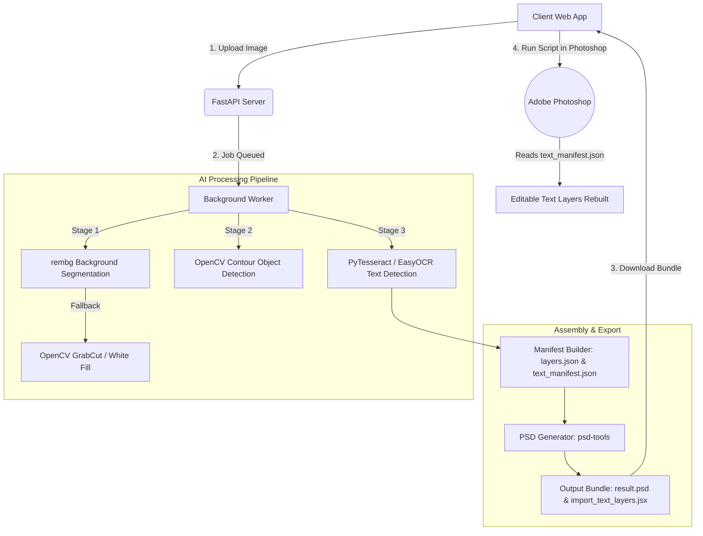

# 🌌 Stratum

> **AI-Powered Image Decomposition & Native Photoshop PSD Export Tool**

Stratum is a state-of-the-art web application designed to automatically decompose flat images into layered PSD assets. By leveraging deep learning models for background removal, contour-based object detection, and multi-engine OCR (Optical Character Recognition), Stratum splits any standard image into isolated background, foreground object, and native text layers.

---

## 🚀 Overview

Decomposing a flat graphic design or image into layers is a tedious, manual chore. Stratum automates this process:
1. **Upload**: User uploads an image (PNG, JPEG, WEBP).
2. **AI Segmentation**: The pipeline isolates the background and extracts individual foreground objects.
3. **OCR Text Extraction**: Text areas are identified, cropped, and recognized.
4. **PSD Assembly**: A multi-layer `.psd` file is generated containing all isolated image elements.
5. **Photoshop Import**: A custom ExtendScript imports the text manifest, rebuilding them as fully editable native TypeLayers.

---

## 🏗️ Architecture

Stratum uses a decoupled **React client + FastAPI server** architecture.



---

## 🧠 AI & Computer Vision Usage

Stratum utilizes specialized models for each layer-separation task:

*   **Background Removal (`rembg`)**: Powered by the **U-2-Net** deep learning model to separate salient foreground elements from the background.
    *   *Fallback*: OpenCV's **GrabCut** algorithm is initialized dynamically if the deep learning environment is offline.
*   **Object Isolation (OpenCV)**: Analyzes the alpha mask of the foreground, performs contour detection (`findContours`), and calculates bounding boxes to extract and crop isolated objects.
*   **Text Detection & Recognition (OCR)**:
    *   **PyTesseract**: Wraps the Tesseract OCR engine (LSTM-based text recognizer) for high-speed character localization.
    *   **EasyOCR Fallback**: If Tesseract is not installed locally, the pipeline falls back to **EasyOCR** (built on PyTorch, utilizing a ResNet backbone and BiLSTM-CTC recognition).

---

## 📦 Modules & Dependencies

### Backend (Python)
- **FastAPI & Uvicorn**: Async API routing and high-performance server.
- **Pillow (PIL)**: Image editing, cropping, and thumbnail creation.
- **psd-tools**: Low-level generation and structure assembly of PSD files.
- **rembg**: Deep learning-based background removal.
- **opencv-python-headless**: High-performance contour mapping and image math.
- **pytesseract & easyocr**: Dual-engine OCR and text bounding box detection.
- **PyTorch**: Deep learning backend for EasyOCR.

### Frontend (React + Vite)
- **React 19**: Modern component architecture.
- **Axios**: Network request handler for communicating with the backend.
- **Vite**: Rapid hot-reloading development server.

---

## 🛠️ Requirements & System Setup

### Prerequisites
1.  **Python**: 3.11 or higher installed.
2.  **Node.js**: v18.0.0 or higher.
3.  **Tesseract OCR** *(Optional but recommended)*:
    *   **Windows**: Download installer from [UB Mannheim](https://github.com/UB-Mannheim/tesseract/wiki) and add `C:\Program Files\Tesseract-OCR` to your System PATH.
    *   **macOS**: Run `brew install tesseract`.
    *   **Linux**: Run `sudo apt-get install tesseract-ocr`.
4.  **Adobe Photoshop**: Photoshop CC (for using the ExtendScript).

---

## 💻 How to Run the Application

### 1. Start the Backend API Server

Navigate to the project root directory:

```powershell
# Create a virtual environment
python -m venv .venv

# Activate the virtual environment
# Windows (PowerShell):
.\.venv\Scripts\Activate.ps1
# macOS/Linux:
source .venv/bin/activate

# Install dependencies
pip install -r image-to-psd-backend/requirements.txt

# Run the backend server with reload enabled
$env:PYTHONPATH="image-to-psd-backend"; .\.venv\Scripts\uvicorn image-to-psd-backend.main:app --reload --port 8000
```
The backend API documentation will be available at [http://localhost:8000/docs](http://localhost:8000/docs).

### 2. Start the Frontend Client

Navigate to the `frontend` directory in a new terminal window:

```bash
# Enter the frontend folder
cd frontend

# Install Node modules
npm install

# Start the Vite development server
npm run dev
```
Open your browser and navigate to [http://localhost:5173/](http://localhost:5173/).

---

## 🎨 Importing Text Layers Natively into Photoshop

Since Photoshop's proprietary text-rendering engine (TypeLayers) is complex and difficult to write directly via third-party Python libraries, Stratum uses a manual ExtendScript import process to recreate **100% editable text layers**:

1.  Download the **Output Bundle** (`result.psd`, `text_manifest.json`, and `import_text_layers.jsx`) from Stratum's UI.
2.  **Open** the `result.psd` file in Adobe Photoshop.
3.  Navigate to **File > Scripts > Browse...** (or **Other Scripts...**) and select the downloaded `import_text_layers.jsx`.
4.  When prompted by the script dialog, select the `text_manifest.json` file.
5.  *Done!* The script will dynamically generate text layers matching the original positions, fonts, colors, and content in an editable format.

---

## 📸 Screenshots

Please see the screenshots below illustrating the Stratum interface and Photoshop import workflow.

*(Note: Drag and drop your screenshots here or attach them when prompted)*

### 1. Web Application Dashboard

*Upload and decomposition processing viewport.*

### 2. Layer Separation View

*Inspection of isolated background, object, and text components.*

### 3. Photoshop ExtendScript Execution
<!-- USER_SCREENSHOT_PHOTOSHOP_IMPORT -->
*Importing the JSON text manifest natively inside Photoshop.*

### 4. Final Editable Result
<!-- USER_SCREENSHOT_FINAL_PSD -->
*Fully layered, editable PSD workspace.*