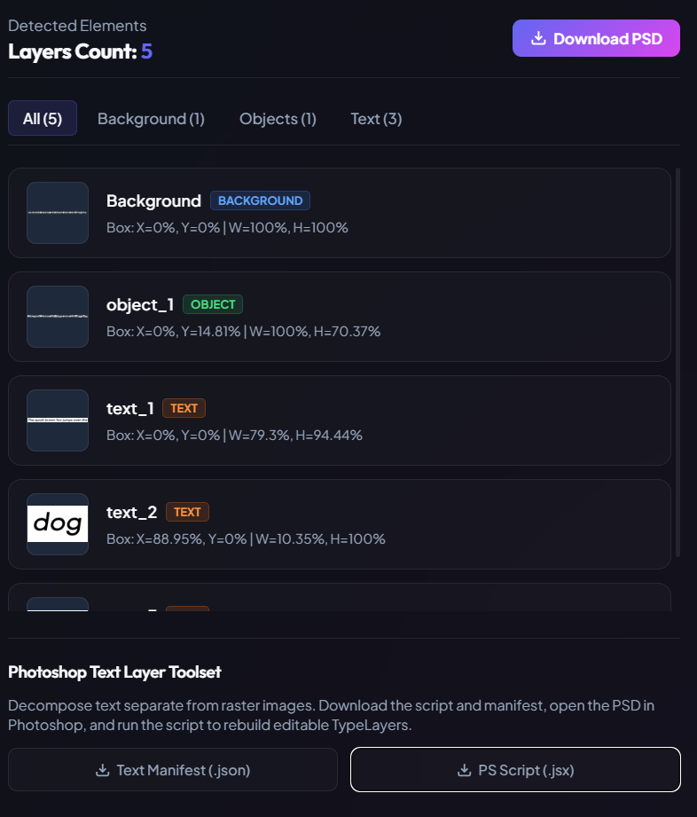
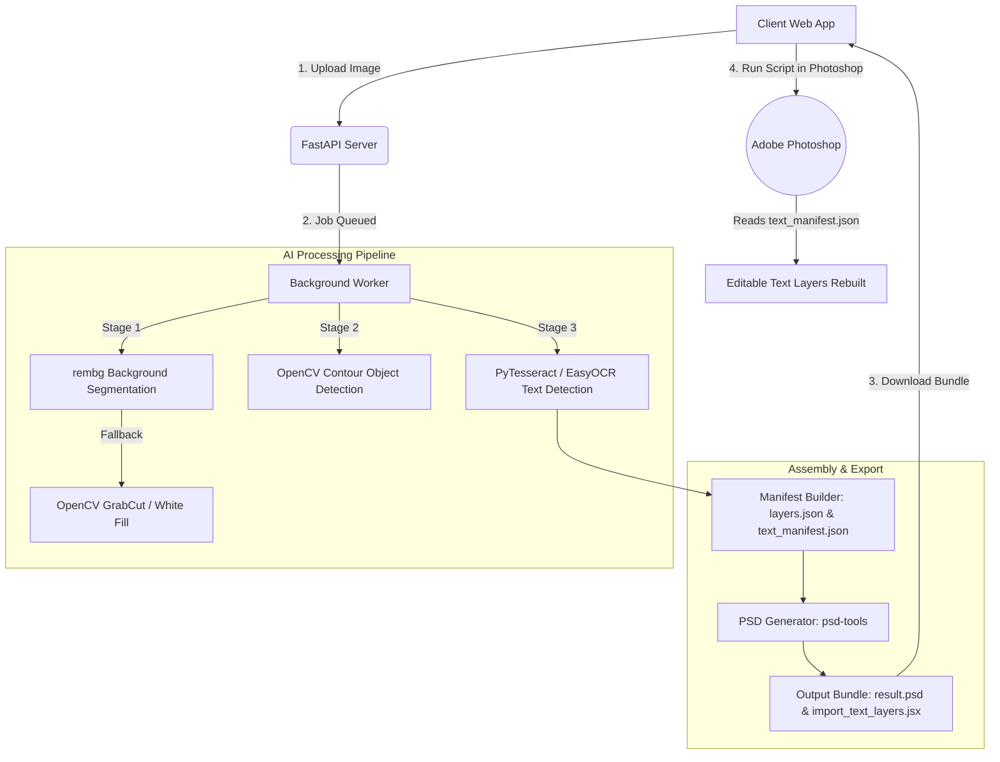

# 🌌 Stratum

Stratum is an **AI-powered image decomposition framework** designed to decompose flat graphics into layered PSD files with minimal engineering effort. By leveraging deep learning models for background removal, contour-based object detection, and multi-engine OCR (Optical Character Recognition), Stratum splits any standard image into isolated background, foreground object, and native text layers.

⭐ **If you find Stratum useful, please consider giving us a star on GitHub! Your support helps us continue to innovate and deliver exciting features.**


[](https://github.com/l1thin/stratum/issues)
[](https://github.com/l1thin/stratum/stargazers)


<p align="center">
    
</p>

<p align="center">
    
</p>

## All features

- **Visual Dashboard:** Upload files (PNG, JPEG, WEBP) and preview the real-time decomposition results.
- **AI Background Removal:** Powered by `rembg` (U-2-Net model) to isolate foreground graphics seamlessly.
- **Dynamic GrabCut Fallback:** OpenCV GrabCut is initialized dynamically if the AI pipeline is offline.
- **Object Contour Detection:** Automatic bounding-box localization using OpenCV contour mapping (`findContours`).
- **Multi-Engine OCR:** Extract text layers via PyTesseract with a PyTorch-based EasyOCR fallback.
- **Native PSD Export:** Directly package separated layers into a standard `.psd` workspace.
- **Editable Photoshop TypeLayers:** Recreate 100% editable text assets natively using a custom ExtendScript JSX script.
- **Unified Docker Architecture:** Multi-stage Dockerfile that packages React + FastAPI for one-click deployment.

<hr>

## Quickstart
The easiest way to get started with Stratum is by visiting the hosted live environment:
🌐 **Live Demo**: [https://l1thin-stratum.hf.space/](https://l1thin-stratum.hf.space/)

### Try using Docker
Want to give Stratum a quick spin on your local machine? You can build and run the Docker image from your terminal right away:

```bash
# Build the unified image
docker build -t stratum .

# Run the container locally
docker run \
  --name stratum \
  --restart unless-stopped \
  -p 7860:7860 \
  stratum
```

Once running, access the web client at [http://localhost:7860](http://localhost:7860).

---

## Architecture

Stratum uses a decoupled **React client + FastAPI server** architecture.

In development, these run as separate servers. In production, they are packaged into a single unified Docker container, where the FastAPI server compiles and hosts the React client statically, enabling zero-config deployment.



### AI & Computer Vision Pipeline Details
*   **Background Removal (`rembg`)**: Powered by the **U-2-Net** deep learning model to separate salient foreground elements from the background.
*   **Object Isolation (OpenCV)**: Analyzes the alpha mask of the foreground, performs contour detection (`findContours`), and calculates bounding boxes to extract and crop isolated objects.
*   **Text Detection & Recognition (OCR)**:
    *   **PyTesseract**: Wraps the Tesseract OCR engine (LSTM-based text recognizer) for high-speed character localization.
    *   **EasyOCR Fallback**: If Tesseract is not installed locally, the pipeline falls back to **EasyOCR** (built on PyTorch, utilizing a ResNet backbone and BiLSTM-CTC recognition).

---

## Tutorials and examples

[PSD Text Import Workflow](docs/PSD_TEXT_IMPORT_WORKFLOW.md)<br>
[User Guide: Photoshop ExtendScript Flow](docs/USER_GUIDE_PSD_WORKFLOW.md)<br>
[General User Guide](docs/USER_GUIDE.md)<br>

## Documentation
- [API Reference Guide](docs/API_REFERENCE.md)<br>
- [API Contract Spec](docs/API_CONTRACT.md)<br>
- [Changelog History](docs/CHANGELOG.md)<br>

## Self-hosted

You can use the Hugging Face hosted platform or self-host Stratum. We support Docker, local virtualenvs, and custom Cloud Runs.

| Provider  | Documentation |
| :------------- | :------------- |
| Hugging Face Spaces (Docker) | [Link](#-deployment-hugging-face-spaces-docker)  |
| Local Docker  | [Link](#try-using-docker)   |
| Manual Installation (Vite + Uvicorn) | [Link](#manual-installation-and-setup)  |

### Manual Installation and Setup

#### Prerequisites
1.  **Python**: 3.11 or higher installed.
2.  **Node.js**: v18.0.0 or higher.
3.  **Tesseract OCR** *(Optional but recommended)*:
    *   **Windows**: Download installer from [UB Mannheim](https://github.com/UB-Mannheim/tesseract/wiki) and add `C:\Program Files\Tesseract-OCR` to your System PATH.
    *   **macOS**: Run `brew install tesseract`.
    *   **Linux**: Run `sudo apt-get install tesseract-ocr`.
4.  **Adobe Photoshop**: Photoshop CC (for using the ExtendScript).

#### 1. Start the Backend API Server
Navigate to the project root directory:

```powershell
# Create a virtual environment
python -m venv .venv

# Activate the virtual environment
# Windows (PowerShell):
.\.venv\Scripts\Activate.ps1
# macOS/Linux:
source .venv/bin/activate

# Install dependencies
pip install -r image-to-psd-backend/requirements.txt

# Run the backend server with reload enabled
$env:PYTHONPATH="image-to-psd-backend"; .\.venv\Scripts\uvicorn image-to-psd-backend.main:app --reload --port 8000
```
The backend API documentation will be available at [http://localhost:8000/docs](http://localhost:8000/docs).

#### 2. Start the Frontend Client
Navigate to the `frontend` directory in a new terminal window:

```bash
# Enter the frontend folder
cd frontend

# Install Node modules
npm install

# Start the Vite development server
npm run dev
```
Open your browser and navigate to [http://localhost:5173/](http://localhost:5173/).

---

## 🌐 Deployment (Hugging Face Spaces Docker)

Stratum is designed to be easily containerized and deployed as a unified application. Hugging Face Spaces is the recommended platform for hosting, as it provides a free 16GB RAM CPU runtime which is ideal for running the AI models (`rembg` and `EasyOCR` with `PyTorch`).

### How to Deploy:
1. Create a new **Space** on Hugging Face.
2. Select **Docker** as the SDK (use **Blank** template).
3. Clone the Space repository and copy the project files (`Dockerfile`, `.dockerignore`, `frontend/`, `image-to-psd-backend/`) into it.
4. **Git LFS**: Since the frontend contains large image assets, make sure Git LFS is initialized in the Space repository and tracking is enabled for images:
   ```bash
   git lfs install
   git lfs track "*.png" "*.jpg" "*.jpeg"
   ```
5. Commit and push the changes:
   ```bash
   git add .
   git commit -m "Deploy Stratum"
   git push origin main
   ```
6. Hugging Face will automatically build and run the Docker container. Once live, the app will be accessible at `https://<your-username>-stratum.hf.space` and will automatically connect to its own backend out-of-the-box.

---

## 🎨 Importing Text Layers Natively into Photoshop

Since Photoshop's proprietary text-rendering engine (TypeLayers) is complex and difficult to write directly via third-party Python libraries, Stratum uses a manual ExtendScript import process to recreate **100% editable text layers**:

1.  Download the **Output Bundle** (`result.psd`, `text_manifest.json`, and `import_text_layers.jsx`) from Stratum's UI.
2.  **Open** the `result.psd` file in Adobe Photoshop.
3.  Navigate to **File > Scripts > Browse...** (or **Other Scripts...**) and select the downloaded `import_text_layers.jsx`.
4.  When prompted by the script dialog, select the `text_manifest.json` file.
5.  *Done!* The script will dynamically generate text layers matching the original positions, fonts, colors, and content in an editable format.

---

## Community support
For general help using Stratum, please refer to the official documentation and user guides. For additional help, you can use these channels:

- [GitHub Issues](https://github.com/l1thin/stratum/issues) - For bug reports and feature requests.
- [GitHub Pull Requests](https://github.com/l1thin/stratum/pulls) - To contribute code and report improvements.

## Roadmap
Check out what features are planned for Stratum:
- **SAM Integration:** Deep integration with Segment Anything Model (SAM) for complex semantic object mapping.
- **Interactive Web Editor:** Bounding-box inspector to adjust, scale, and delete layer boundaries before export.
- **Font Matcher:** Direct integration with Google Fonts to automatically pair matched OCR typography.
- **Multi-canvas exporter:** Combine multiple image assets and decompose them into a single Photoshop layout.

## Branching model
We use the git-flow branching model. The base branch is `develop`. Stable versions are tagged and released on the `main` branch.

## Contributing
Kindly open an issue or start a pull request on GitHub to suggest bug fixes, custom scripts, or additional features.

## Contributors
<a href="https://github.com/l1thin/stratum/graphs/contributors">
  
</a>

## License
Stratum © 2026, Lithin - All rights reserved. You must obtain explicit permission from the author to use this project.